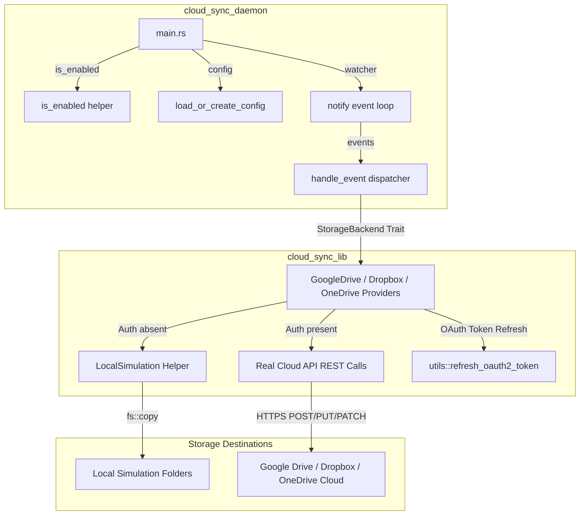

# Workspace Architecture

This document describes the modular architecture of the Cloud Sync workspace, detailing the interaction between `cloud_sync_daemon`, `cloud_sync_lib`, and the individual cloud storage backends.

---

## High-Level Architecture Diagram

The diagram below outlines the synchronization flow and modular structure of the workspace:

---

## Core Components

### 1. `cloud_sync_daemon`
- **Configuration Parsing**: Reads and validates `private_config.toml` (parsed into `AppConfig`). Uses the `is_enabled` helper function to determine which providers are toggled on.
- **File System Monitoring**: Utilizes the `notify` crate to watch for file system additions, modifications, and deletions.
- **Event Dispatching**:
  - `handle_event` filters out irrelevant events (e.g. directories, temporary writes).
  - Uses `tokio::spawn` to process synchronization events concurrently across all registered backends.
  - Implements concurrency locks (per file, per provider) and a 3-attempt retry loop for resilient uploads.

### 2. `cloud_sync_lib`
- **`StorageBackend` Trait**: The core interface defined in [`traits.rs`](file:///home/robt/projects/cloud_sync_lib/cloud_sync_lib/src/traits.rs). It guarantees consistent APIs (`upload`, `download`, `delete`, `list`) for all providers.
- **Provider Clients**:
  - [`google_drive.rs`](file:///home/robt/projects/cloud_sync_lib/cloud_sync_lib/src/providers/google_drive.rs): Integrates with Google Drive API v3 (multipart upload/patch).
  - [`dropbox.rs`](file:///home/robt/projects/cloud_sync_lib/cloud_sync_lib/src/providers/dropbox.rs): Integrates with Dropbox API v2 (handles custom path prefixes).
  - [`onedrive.rs`](file:///home/robt/projects/cloud_sync_lib/cloud_sync_lib/src/providers/onedrive.rs): Integrates with Microsoft Graph API for OneDrive.
- **DRY Refactoring Helpers**:
  - [`local_sim.rs`](file:///home/robt/projects/cloud_sync_lib/cloud_sync_lib/src/providers/local_sim.rs): Shared simulated filesystem module `LocalSimulation`. Providers delegate fallback logic here when API credentials are absent.
  - [`utils.rs`](file:///home/robt/projects/cloud_sync_lib/cloud_sync_lib/src/providers/utils.rs): Unified `refresh_oauth2_token` helper to perform standard OAuth2 refresh exchanges.
