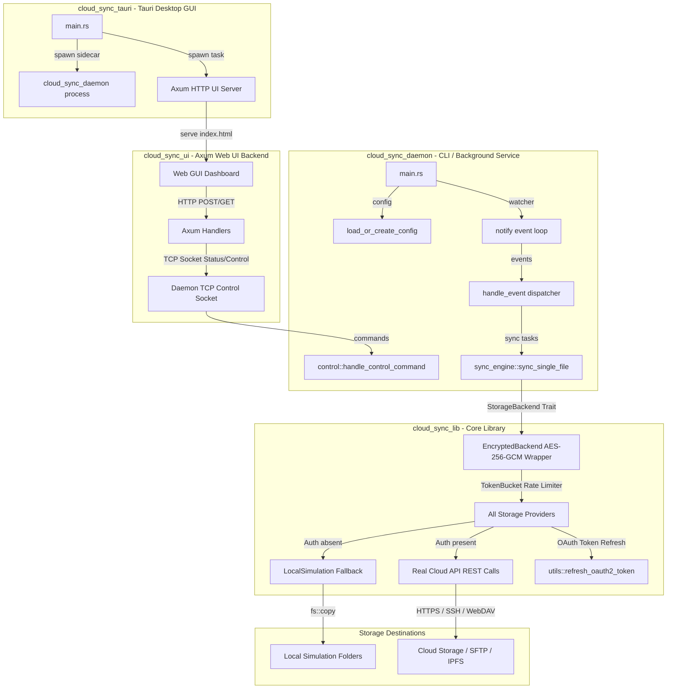

# Workspace Architecture

This document describes the modular architecture of the Cloud Sync workspace, detailing the interaction between the Tauri desktop app, the decoupled Axum Web UI, the `cloud_sync_daemon`, `cloud_sync_lib`, and the individual cloud storage backends.

---

## High-Level Architecture Diagram

The diagram below outlines the synchronization flow, TCP control sockets, HTTP endpoints, and modular structure of the workspace:

---

## Core Components

### 1. `cloud_sync_tauri`
- **Application Entry Point**: Boots the desktop application framework, launching both the background Axum UI server and the daemon process as a Tauri sidecar wrapper.
- **Sidecar Lifecycle**: Controls startup and shutdown of the daemon sidecar process.

### 2. `cloud_sync_ui`
- **Decoupled API Server**: An Axum HTTP server running on port `8082`. It exposes HTTP endpoints (such as `/api/status`, `/api/start`, `/api/pause`, `/api/sync`, `/api/stop`) and tunnels commands to the daemon's TCP control socket.
- **Embedded Web Dashboard**: Hosts and serves an interactive dashboard user interface built inside a single page (`index.html`).

### 3. `cloud_sync_daemon`
- **Configuration Parsing**: Reads and validates `private_config.toml` (parsed into `AppConfig`). Sets up global rates and backend-specific parameters.
- **File System Monitoring**: Utilizes the `notify` crate to watch for file system additions, modifications, and deletions.
- **TCP Control Socket**: Binds to port `8081` for receiving control commands (start, stop, pause, resume, sync, status, reload, etc.).
- **Synchronization Engine**:
  - Performs local/remote directory scans to build state maps.
  - Implements **Two-Way Synchronization**: compares file metadata, checksums, and modification times.
  - Handles conflicts by renaming the local conflict copy to `*.local-conflict` and uploading it while downloading the remote version.
  - Features verification loops (3-attempt retries verifying file integrity via SHA-256 checksums).

### 4. `cloud_sync_lib`
- **`StorageBackend` Trait**: The core interface defined in [`traits.rs`](file:///home/robt/projects/cloud_sync_lib/cloud_sync_lib/src/traits.rs). It guarantees consistent APIs (`upload`, `download`, `delete`, `list`, `create_folder`) for all providers.
- **Provider Clients**:
  - [`google_drive.rs`](file:///home/robt/projects/cloud_sync_lib/cloud_sync_lib/src/providers/google_drive.rs): Google Drive API v3.
  - [`dropbox.rs`](file:///home/robt/projects/cloud_sync_lib/cloud_sync_lib/src/providers/dropbox.rs): Dropbox API v2.
  - [`onedrive.rs`](file:///home/robt/projects/cloud_sync_lib/cloud_sync_lib/src/providers/onedrive.rs): Microsoft Graph API for OneDrive.
  - [`box_provider.rs`](file:///home/robt/projects/cloud_sync_lib/cloud_sync_lib/src/providers/box_provider.rs): Box OAuth2 API.
  - [`mega_provider.rs`](file:///home/robt/projects/cloud_sync_lib/cloud_sync_lib/src/providers/mega_provider.rs): MEGA client API.
  - [`azure_blob.rs`](file:///home/robt/projects/cloud_sync_lib/cloud_sync_lib/src/providers/azure_blob.rs): Azure Blob Storage.
  - [`gcs.rs`](file:///home/robt/projects/cloud_sync_lib/cloud_sync_lib/src/providers/gcs.rs): Google Cloud Storage.
  - [`b2.rs`](file:///home/robt/projects/cloud_sync_lib/cloud_sync_lib/src/providers/b2.rs): Backblaze B2.
  - [`pcloud.rs`](file:///home/robt/projects/cloud_sync_lib/cloud_sync_lib/src/providers/pcloud.rs): pCloud.
  - [`ipfs.rs`](file:///home/robt/projects/cloud_sync_lib/cloud_sync_lib/src/providers/ipfs.rs): IPFS pinning service.
  - [`s3.rs`](file:///home/robt/projects/cloud_sync_lib/cloud_sync_lib/src/providers/s3.rs): S3-compatible API.
  - [`sftp.rs`](file:///home/robt/projects/cloud_sync_lib/cloud_sync_lib/src/providers/sftp.rs): SFTP Client.
  - [`webdav.rs`](file:///home/robt/projects/cloud_sync_lib/cloud_sync_lib/src/providers/webdav.rs): WebDAV Client.
  - [`nextcloud.rs`](file:///home/robt/projects/cloud_sync_lib/cloud_sync_lib/src/providers/nextcloud.rs): Nextcloud-specific WebDAV & OCS client.
- **Feature Wrappers & Helpers**:
  - [`encryption.rs`](file:///home/robt/projects/cloud_sync_lib/cloud_sync_lib/src/providers/encryption.rs): `EncryptedBackend` decorator that adds client-side AES-256-GCM zero-knowledge encryption transparently.
  - [`rate_limit.rs`](file:///home/robt/projects/cloud_sync_lib/cloud_sync_lib/src/rate_limit.rs): `TokenBucket` rate limiter for imposing bandwidth ceilings on uploads/downloads.
  - [`local_sim.rs`](file:///home/robt/projects/cloud_sync_lib/cloud_sync_lib/src/providers/local_sim.rs): Local simulation backend (`LocalSimulation`) acting as fallback when API credentials are absent.
  - [`utils.rs`](file:///home/robt/projects/cloud_sync_lib/cloud_sync_lib/src/providers/utils.rs): Unified OAuth2 refresh exchanges.
