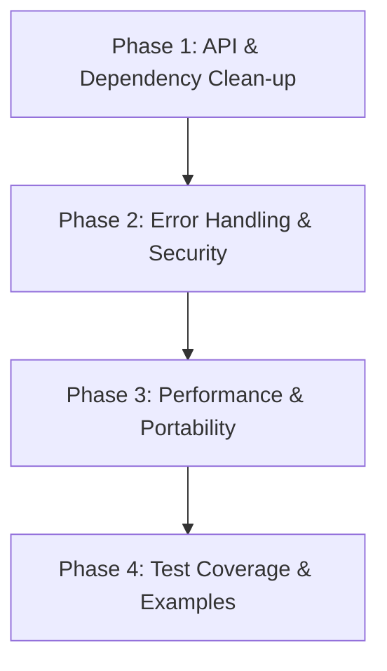

# Refactor Plan: Aligning `cloud_sync_lib` with Core Software Library Attributes

This document outlines a concrete refactor plan for `cloud_sync_lib` to align it with the 10 software library attributes defined in [attributes.md](file:///home/robt/projects/cloud_sync_lib/notes/attributes.md).

---

## 1. Executive Summary
`cloud_sync_lib` is a modular Rust library supporting 14+ storage backends with features like simulation fallback, rate-limiting, client-side encryption, and retry logic. While functional and well-covered by basic simulation tests, several areas must be restructured or polished to reach the high standard of a production-grade library.

This plan systematically maps each of the 10 key attributes to the library's current state, identifies existing gaps, and details actionable refactoring tasks.

---

## 2. Detailed Attribute Analysis & Refactor Steps

### Attribute 1: Intuitive API Design
* **Current State:** The primary integration boundary is the `StorageBackend` trait. However, `StorageBackend` features a mix of core functionalities (e.g., `upload`, `download`, `delete`, `list`) and provider-specific/sync settings (e.g., `sync_mode`, `sync`, `sync_both`). Moreover, `with_limiters` returns `Self` but has a dummy default implementation that doesn't adapt easily when dynamic dispatch is used.
* **Gaps:** 
  - Having `sync_mode` and sync-propagation checks in `StorageBackend` conflates backend access with sync policy management.
  - Return types for operations like `list` return raw `StorageItem` containing platform-specific paths directly instead of a standardized abstraction.
* **Refactor Plan:**
  - Separate sync configuration policy into a separate structure or engine trait (e.g., `SyncEngine` or `SyncPolicy`) rather than polluting `StorageBackend`.
  - Refactor `with_limiters` to be configurable on backend builders or constructors, avoiding trait-level self-consuming method signatures that complicate `Box<dyn StorageBackend>`.

### Attribute 2: Comprehensive Documentation
* **Current State:** The library contains basic inline module docs, but lacks high-level usage tutorials, configuration guides, or detailed error-handling explanations.
* **Gaps:**
  - No documentation on how to add new backends.
  - No detailed API reference or example folder showing basic upload/download.
* **Refactor Plan:**
  - Create an `/examples` directory demonstrating common use cases (e.g., simple file synchronization, rate-limiting configuration, client-side encryption).
  - Expand inline doc comments for all public traits and structures to generate beautiful Rustdocs (`cargo doc`).

### Attribute 3: High Reliability
* **Current State:** The library handles retries on transient errors in `providers::utils::execute_with_retry`.
* **Gaps:**
  - Error enum `StorageError` lacks fine-grained distinction for some network vs server vs client errors.
  - Resource exhaustion or rate-limiting is detected via simple substring matching (`msg.contains("429")`), which is fragile.
* **Refactor Plan:**
  - Standardize error mapping inside each provider to ensure raw client errors (e.g., reqwest, ssh2) map cleanly to `StorageError` categories without relying on ad-hoc string comparisons.
  - Enhance HTTP error parsing to inspect response headers (e.g., `Retry-After`) to calculate accurate backoff windows.

### Attribute 4: Performance and Efficiency
* **Current State:** The library implements rate limiting via token buckets and supports streaming uploads.
* **Gaps:**
  - Directory listing via `list` fetches everything at once, which could cause high memory usage on large buckets.
  - Checksum calculation uses a fixed 8KB buffer.
* **Refactor Plan:**
  - Introduce pagination or async streams for directory listing (`list_stream`) where supported by backend APIs.
  - Optimize the internal buffers for checksum computations and streaming operations to dynamically resize or use larger standard buffer sizes (e.g., 64KB).

### Attribute 5: Maintainability
* **Current State:** There is a lot of duplicated code across the 14+ provider implementations for handling credentials, request building, and simulation fallback logic.
* **Gaps:**
  - `SimulatedFallback` wraps backends to handle simulation mode, but the simulation paths are hardcoded.
* **Refactor Plan:**
  - Consolidate common HTTP client request builders and header settings into a reusable helper class or trait extension for providers.
  - Decouple simulation roots from being hardcoded in `SimulatedFallback`, allowing injection of simulator configurations.

### Attribute 6: Flexibility and Customization
* **Current State:** Some behaviors are hard-coded per provider (e.g., timeouts, headers, chunk sizes).
* **Gaps:**
  - Users cannot customize timeout duration or request headers when building a provider.
* **Refactor Plan:**
  - Introduce a builder pattern (`GoogleDriveProviderBuilder`, etc.) that allows fine-tuning settings such as custom timeouts, custom headers, and retries.

### Attribute 7: Strong Security
* **Current State:** Client-side encryption is implemented in `providers::encryption::EncryptedBackend`.
* **Gaps:**
  - Security keys and credentials (e.g., in `config.toml`) are loaded in plain text without secure memory sanitization or clearing buffers.
* **Refactor Plan:**
  - Use zeroization (`zeroize` crate) for security-sensitive structs (e.g., encryption passwords, access keys) to clear secrets from memory when they go out of scope.

### Attribute 8: High Testability
* **Current State:** Providers support mock endpoint redirection, allowing test flows with `wiremock`.
* **Gaps:**
  - Basic simulation tests run on temp directories, but mock HTTP flow tests are limited to Google Drive and Dropbox.
* **Refactor Plan:**
  - Add mock HTTP flow tests using `wiremock` for other critical backends (e.g., OneDrive, S3, WebDAV) to verify raw HTTP response parsing and error handling without contacting real services.

### Attribute 9: Compatibility and Portability
* **Current State:** Path conversions assume relative paths using forward slashes `/` on remote backends, but use `PathBuf` internally which adapts to local OS settings.
* **Gaps:**
  - Platform-specific path separator issues can occur when translating between local paths (e.g., Windows backslashes `\`) and remote paths (always `/`).
* **Refactor Plan:**
  - Add explicit sanitization for all path transitions to ensure that path inputs are normalized to standard Unix-style paths before sending to remote APIs, ensuring complete cross-platform compatibility.

### Attribute 10: Low Dependency Footprint
* **Current State:** The library references many external dependencies (e.g., `rust-s3`, `ssh2`, `mega`, `yup-oauth2`) as optional features.
* **Gaps:**
  - Features are all enabled by default, increasing the binary size for users who only need a subset.
* **Refactor Plan:**
  - Keep features disabled by default in `Cargo.toml`. Users should explicitly opt-in to the specific backends they require (e.g., `features = ["s3"]`).

---

## 3. Phased Implementation Plan

### Phase 1: API & Dependency Clean-up
- **API Simplification:** Move policy helper methods (`sync_mode`, `sync_deletions`, etc.) out of the `StorageBackend` trait.
- **Optional Dependencies:** Change the default features list in `Cargo.toml` to compile with zero features enabled by default.
- **Provider Builders:** Implement builder patterns for all backends to configure timeouts, custom headers, and token refresh configurations.

### Phase 2: Error Handling & Security
- **Secure Memory:** Integrate the `zeroize` crate for sensitive structs (`OAuthCredentials`, `encryption_password`).
- **Error Standardizing:** Revamp `StorageError` to include structured HTTP status codes, parsing remote details without brittle string matching.

### Phase 3: Performance & Portability
- **Path Normalization:** Implement helper functions to guarantee standard slashes `/` on all remote backend operations.
- **Streaming Improvements:** Add pagination support to directory listing.

### Phase 4: Test Coverage & Examples
- **HTTP Mocking:** Implement `wiremock` coverage for S3 and WebDAV.
- **Examples:** Add example programs in `/examples` demonstrating quick integrations.
